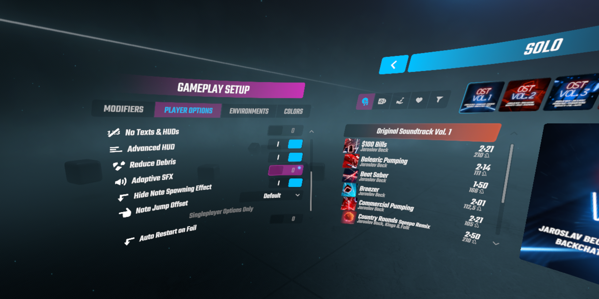

# Beat Saber AdaptiveSFXRemover

Disables automatic SFX volume adjustments.

You can enable/disable the mod in the mod settings.

## Notice regarding further mod development!
As of Beat Saber 1.12.1, the option provided by this mod is now part of the base game. You can switch off the adaptive sfx in the player settings (see screenshot below). Because of that, this mod won't get any more updates as long as it is part of the base game settings.

## Installation

Drop the DLL file into your plugins folder. The mod will disable adaptive SFX by default.

You can enable/disable the Adaptive SFX of the base game in the options menu under "Adaptive SFX". Select on to enable the in-game adaptive SFX. Selecting off will disable the adaptive SFX.

## Removal

Delete the DLL file from your plugins folder.
